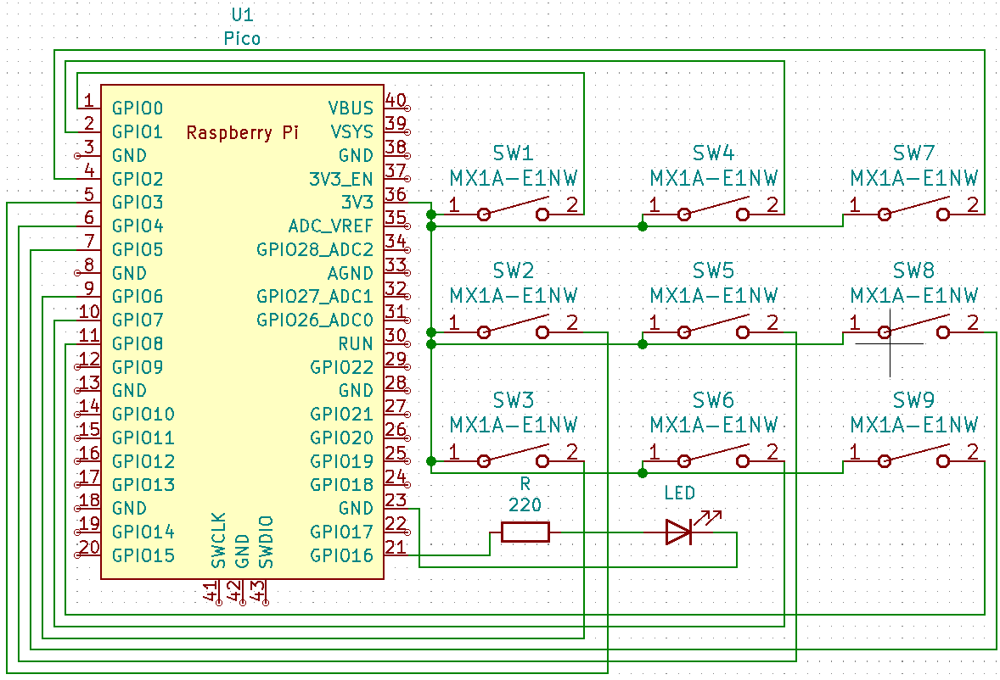

# **Shorty (Re-Programable Macro Board)**

### you can fetch setup guide and files📂 [here](https://sb2001nov.github.io/shorty/)

## **Components Hardware Required:**

1. Raspberry pi Pico ([here](https://datasheets.raspberrypi.com/pico/pico-datasheet.pdf))
1. Cherry MX Style Switch’s ([here](https://cdn.sparkfun.com/datasheets/Components/Switches/MX%20Series.pdf))
1. General Purpose led ([here](https://learn.adafruit.com/all-about-leds/what-is-an-led))
1. Our PCB (here)

## **Specifications For Shorty:**

Contains 9 re-programmable keys for your macro, keys are laid out in 3x3 matrix.

1. **Switch:** Key switch with fixation pins (1 pole), hot swappable (should contain same mount point as mentioned).
1. **Keycaps:** can be 3d printed using given model or can pe purchased online.

### **Note:**
Match keycap size before purchasing, supported keycaps are alphabetic caps.

1. **Size:** x = 93.47mm, y = 62.99 mm
1. **Mounting:** Keycap can be mounted using 5 2.1 mm mounting bits.
1. **Connection:** Micro-B USB.

## **Programing Specification:**

1. micro-python - supported firmware and installation guide is [here](https://projects.raspberrypi.org/en/projects/getting-started-with-the-pico/3).
1. circuit-python - supported native and recommended to use.
1. C/C++ - can be uploaded using Thonny ide.
1. QMK firmware - customizable firmware.

## **Circuit Symantec**

Each switch is connected to a 3.3-Volt power pin and the other pin is connected to a GPIO pin to receive the data from the switch(input).
It also contains an LED which you can use to show the status of anything you desire like showing if the voltage is there.

Buttons are connected in such a way that each button has its own GPIO pin, **why?**
 
Because it contains only 9 switches and it would be useless to reduce the number of pin because it will increase the complexity on the connection and increase the number of components used, leading to the code complexity.

*Complete information about RP2040 can be found [here*](https://datasheets.raspberrypi.com/pico/pico-datasheet.pdf)*

## **PCB Symantec**

All the details about PCB can be found on the GitHub, just open the PCB folder in KiCad.

PCB can be printed by [JLCPCB](https://cart.jlcpcb.com/) just upload the Gerber zip file on JLCPCB website.

## **3d Renders for PCB and components**

### **CHERRY MX + KEYCAPS’**
Stander alphabetical keycap without any legends can be printed using translucent materials or solid material like PLA.

### **CHERRY MX SWITCH**
You can use any switch like blue, jade, etc. as long as you have same mounting point shown in the 3D model to be precise 1 pole without led Connections, with fixation point.

Details can be found [here](https://cdn.sparkfun.com/datasheets/Components/Switches/MX%20Series.pdf)

## **Additional use case:**
Can be use with the script included in “shorty.py” which help you to set keyboard shortcut in your device and then you can program your macro pad to send those specific commands to your device, this way you can swiftly change your macros.
